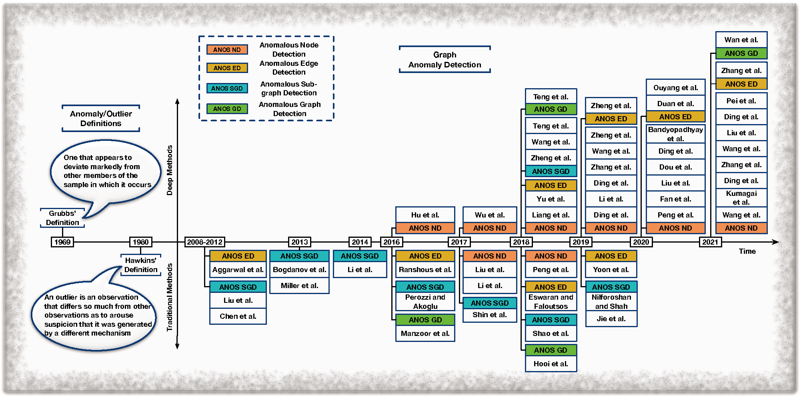
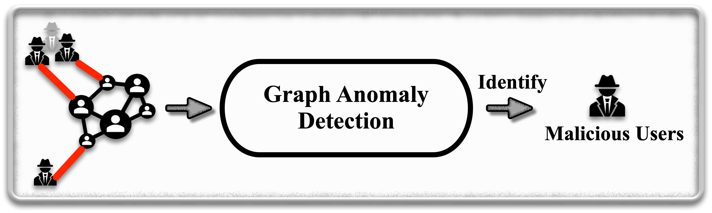
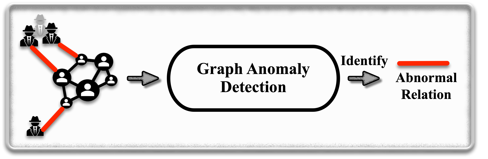
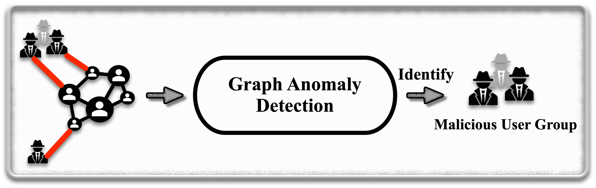
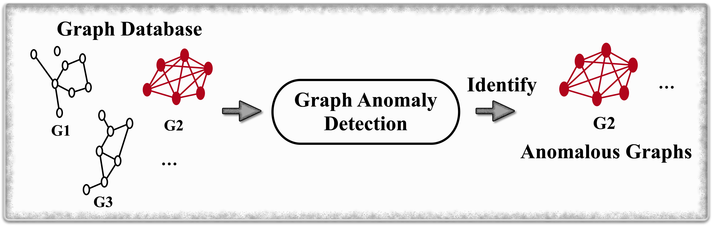
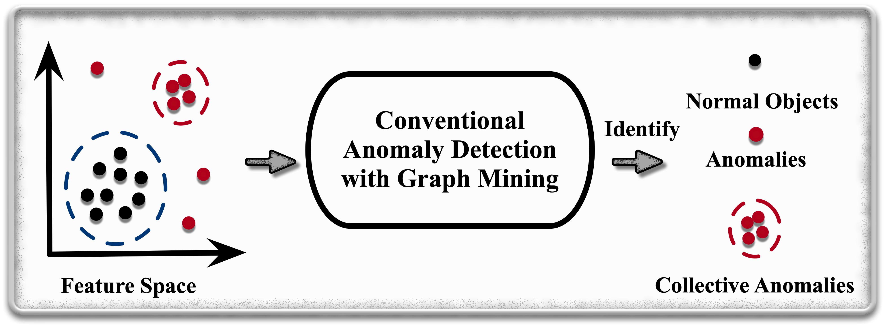

# Awesome-Deep-Graph-Anomaly-Detection

 
 

 

A collection of papers on deep learning for graph anomaly detection, and published algorithms and datasets.

- [Awesome-Deep-Graph-Anomaly-Detection](#awesome-deep-graph-anomaly-detection)
  - [A Timeline of graph anomaly detection](#a-timeline-of-graph-anomaly-detection)
  - [Surveys](#surveys)
  - [Anomalous Node Detection](#anomalous-node-detection)
  - [Anomalous Edge Detection](#anomalous-edge-detection)
  - [Anomalous Sub-graph Detection](#anomalous-sub-graph-detection)
  - [Anomalous Graph-Level Detection](#anomalous-graph-level-detection)
  - [Graph-Based Anomaly Detection Methods](#graph-based-anomaly-detection-methods)
  - [Open-sourced Graph Anomaly Detection Libraries](#open-sourced-graph-anomaly-detection-libraries)
  - [Datasets](#datasets)
    - [Mostly-used Benchmark Datasets](#mostly-used-benchmark-datasets)
    - [Citation/Co-authorship Networks](#citationco-authorship-networks)
    - [Social Networks](#social-networks)
    - [Co-purchasing Networks](#co-purchasing-networks)
    - [Transportation Networks](#transportation-networks)
  - [Tools](#tools)

----------
## A Timeline of graph anomaly detection

## Surveys

| **Paper Title** | **Venue** | **Year** | 
| --------------- | ---- | ---- | 
| [Graph Neural Networks for Anomaly Detection in Industrial Internet of Things](https://ieeexplore.ieee.org/document/9471816) | _IEEE Internet of Things Journal_ | 2022 |
| [A Comprehensive Survey on Graph Anomaly Detection with Deep Learning](https://ieeexplore.ieee.org/abstract/document/9565320) | _TKDE_ | 2021 |
| [Deep learning for anomaly detection](https://dl.acm.org/doi/pdf/10.1145/3439950) | _ACM Comput. Surv._ | 2021 |
| [Anomaly detection for big data using efficient techniques: A review](https://link.springer.com/chapter/10.1007/978-981-15-3514-7_79) | AIDE | 2021 | 
| [Anomalous Example Detection in Deep Learning: A Survey](https://ieeexplore.ieee.org/iel7/6287639/8948470/09144212.pdf) | _IEEE_ | 2021 |
| [Outlier detection: Methods, models, and classification](https://dl.acm.org/doi/pdf/10.1145/3381028) |_ACM Comput. Surv._ | 2020 |
| [A comprehensive survey of anomaly detection techniques for high dimensional big data](https://link.springer.com/article/10.1186/s40537-020-00320-x) | _J. Big Data_ | 2020 |
| [Machine learning techniques for network anomaly detection: A survey](https://ieeexplore.ieee.org/iel7/9081868/9089428/09089465.pdf)| _Int. Conf. Inform. IoT Enabling Technol_ | 2020 |
| [Fraud detection: A systematic literature review of graph-based anomaly detection approaches](https://dl.acm.org/doi/10.1145/3172867) | _DSS_ | 2020 |
| [A comprehensive survey on network anomaly detection](https://dl.acm.org/doi/10.1145/3172867) | _Telecommun. Syst._ |
| [A survey of deep learning-based network anomaly detection](https://dl.acm.org/doi/10.1145/3172867) | _Clust. Comput._ | 2019 |
 [Combining machine learning with knowledge engineering to detect fake news in social networks-a survey](https://dl.acm.org/doi/10.1145/3172867) | _AAAI_ | 2019 |
| [Deep learning for anomaly detection: A survey](https://arxiv.org/pdf/1901.03407.pdf) | _arXiv_ | 2019 |
| [Anomaly detection in dynamic networks: A survey](https://wires.onlinelibrary.wiley.com/doi/pdfdirect/10.1002/wics.1347) | _Rev. Comput. Stat._ | 2018 |
| [A survey on social media anomaly detection](https://dl.acm.org/doi/pdf/10.1145/2980765.2980767) | _SIGKDD_ | 2016 |
| [Graph based anomaly detection and description: A survey](https://idp.springer.com/authorize/casa?redirect_uri=https://link.springer.com/article/10.1007/s10618-014-0365-y) | _Data Min. Knowl. Discovery_ | 2015 |
| [Anomaly detection in online social networks](https://www.sciencedirect.com/science/article/pii/S0378873314000331) | _Soc. Networks_ | 2014 |
| [A survey of outlier detection methods in network anomaly identification](https://academic.oup.com/comjnl/article-pdf/54/4/570/1024761/bxr026.pdf) | _Comput. J._ | 2011 |
| [Anomaly detection: A survey](https://dl.acm.org/doi/pdf/10.1145/1541880.1541882) |_ACM Comput. Surv._ | 2009 |  

----------

## Anomalous Node Detection

| **Paper Title** | **Venue** | **Year** | **Model** | **Code** |
| ------ | :----: | :--: | :----: | :----: |
| [Anomaly detection on attributed networks via contrastive self-supervised learning](https://ieeexplore.ieee.org/iel7/5962385/6104215/09395172.pdf) | _TNNLS_ | 2021 | CoLA | [[Code]](https://github.com/GRAND-Lab/CoLA) |
| [Cross-domain graph anomaly detection](https://ieeexplore.ieee.org/iel7/5962385/6104215/09556511.pdf) | _TNNLS_ | 2021 | 
-
 | 
-
 |
| [A Synergistic Approach for Graph Anomaly Detection with Pattern Mining and Feature Learning](https://tzhao.io/files/papers/TNNLS21_pamful.pdf) | _TNNLS_ | 2021 | PamFul | [[Code]](https://github.com/zhao-tong/Graph-Anomaly-Loss) |
| [ANEMONE: Graph Anomaly Detection with Multi-Scale Contrastive Learning](https://dl.acm.org/doi/10.1145/3459637.3482057) | _CIKM_ | 2021 | ANEMONE | [[Code]](https://github.com/GRAND-Lab/ANEMONE) |
| [Error-bounded Graph Anomaly Loss for GNNs](https://dl.acm.org/doi/pdf/10.1145/3340531.3411979) | _CIKM_ | 2021 | GAL | [[Code]](https://github.com/zhao-tong/Graph-Anomaly-Loss) |
| [Generative and Contrastive Self-Supervised Learning for Graph Anomaly Detection](https://ieeexplore.ieee.org/document/9568697) | _TKDE_ | 2021 | SL-GAD | [[Code]](https://github.com/KimMeen/SL-GAD) |
| [Fraudre: Fraud detection dual-resistant to graph inconsistency and imbalance](https://ieeexplore.ieee.org/document/9679178) | _ICDM_ | 2021 | Fraudre | [[Code]](https://github.com/FraudDetection/FRAUDRE) |
| [Few-shot network anomaly detection via cross-network meta-learning](https://dl.acm.org/doi/pdf/10.1145/3442381.3449922) | _WWW_ | 2021 | 
-
 | 
-
 |
| [One-class graph neural networks for anomaly detection in attributed networks](https://idp.springer.com/authorize/casa?redirect_uri=https://link.springer.com/article/10.1007/s00521-021-05924-9) | _NCA_ | 2021 | OCGNN | [[Code]](https://github.com/WangXuhongCN/OCGNN) |
| [Decoupling representation learning and classification for gnn-based anomaly detection](https://dl.acm.org/doi/pdf/10.1145/3404835.3462944) | _SIGIR_ | 2021 | DCI | - |
| [Resgcn: Attention-based deep residual modeling for anomaly detection on attributed networks](https://link.springer.com/article/10.1007/s10994-021-06044-0) | _ML_ | 2021 | Resgcn | [[Code]](https://bitbucket.org/paulpei/resgcn/src/master/) |
| [Selective network discovery via deep reinforcement learning on embedded spaces](https://appliednetsci.springeropen.com/articles/10.1007/s41109-021-00365-8) | _ANS_ | 2021 | NAC | - |
| [A deep multi-view framework for anomaly detection on attributed networks](https://ieeexplore.ieee.org/iel7/69/4358933/09162509.pdf) | _TKDE_ | 2020 | ALARM  | - |
| [Enhancing graph neural network-based fraud detectors against camouflaged fraudsters](https://dl.acm.org/doi/pdf/10.1145/3340531.3411903) | _CIKM_ | 2020 | CARE-GNN | [[Code]](https://github.com/YingtongDou/CARE-GNN) |
| [Outlier resistant unsupervised deep architectures for attributed network embedding](https://dl.acm.org/doi/pdf/10.1145/3336191.3371788) | _WSDM_ | 2020 | DONE/AdONE | [[Code]](https://github.com/pygod-team/pygod) |
| [Gcn-based user representation learning for unifying robust recommendation and fraudster detection](https://dl.acm.org/doi/pdf/10.1145/3397271.3401165) | _SIGIR_ | 2020 | GraphRfi | - |
| [Alleviating the Inconsistency Problem of Applying Graph Neural Network to Fraud Detection](https://dl.acm.org/doi/abs/10.1145/3397271.3401253) | _SIGIR_ | 2020 | GraphConsis | [[Code]](https://github.com/safe-graph/DGFraud/tree/master/algorithms/GraphConsis)|
| [Inductive anomaly detection on attributed networks](https://asu.pure.elsevier.com/en/publications/inductive-anomaly-detection-on-attributed-networks) | _IJCAI_ | 2020 | AEGIS | - |
| [Anomalydae: Dual autoencoder for anomaly detection on attributed networks](https://ieeexplore.ieee.org/iel7/9040208/9052899/09053387.pdf) | _ICAPSP_ | 2020 | Anomalydae | [[Code]](https://github.com/haoyfan/AnomalyDAE) |
| [Specae: Spectral autoencoder for anomaly detection in attributed networks](https://dl.acm.org/doi/pdf/10.1145/3357384.3358074) | _CIKM_ | 2019 | Specae | - |
| [A semi-supervised graph attentive network for financial fraud detection](https://ieeexplore.ieee.org/iel7/8961330/8970627/08970829.pdf) | _ICDM_ | 2019 | SemiGNN | [[Code]](https://github.com/safe-graph/DGFraud) |
| [Deep anomaly detection on attributed networks](https://epubs.siam.org/doi/pdf/10.1137/1.9781611975673.67) | _SDM_ | 2019 | Dominant | [[Code]](https://github.com/kaize0409/GCN_AnomalyDetection_pytorch) |
| [One-class adversarial nets for fraud detection](https://ojs.aaai.org/index.php/AAAI/article/view/3924/3802) | _AAAI_ | 2019 | OCAN | [[Code]](https://github.com/PanpanZheng/OCAN) |
| [Interactive anomaly detection on attributed networks](https://dl.acm.org/doi/pdf/10.1145/3289600.3290964) | _WSDM_ | 2019 | GraphUCB | - |
| [Fdgars: Fraudster detection via graph convolutional networks in online app review system](https://dl.acm.org/doi/pdf/10.1145/3308560.3316586) | _WWW_ | 2019 | _Wang et al._ | [[Code]](https://github.com/safe-graph/DGFraud) |
|[A robust embedding method for anomaly detection on attributed networks](https://ieeexplore.ieee.org/iel7/8840768/8851681/08852354.pdf) | _IJCNN_ | 2019 | REMAD | - |
| [Semi-supervised embedding in attributed networks with outliers](https://epubs.siam.org/doi/pdf/10.1137/1.9781611975321.18) | _SDM_ | 2018 | SEANO | - |
| [Netwalk: A flexible deep embedding approach for anomaly detection in dynamic networks](https://dl.acm.org/doi/pdf/10.1145/3219819.3220024) | _SIGKDD_ | 2018 | Netwalk | [[Code]](https://github.com/chengw07/NetWalk) |
| [Anomalous: A joint modeling approach for anomaly detection on attributed networks](https://www.ijcai.org/Proceedings/2018/0488.pdf) | _IJCAI_ | 2018 | ANOMALOUS | - |
| [Accelerated local anomaly detection via resolving attributed networks](https://www.ijcai.org/Proceedings/2017/0325.pdf) | _IJCAI_ | 2017 | ALAD | - |
| [Radar: Residual analysis for anomaly detection in attributed networks](https://www.researchgate.net/profile/Jundong-Li/publication/318830338_Radar_Residual_Analysis_for_Anomaly_Detection_in_Attributed_Networks/links/5a1f17c4458515a4c3d478ce/Radar-Residual-Analysis-for-Anomaly-Detection-in-Attributed-Networks.pdf) | _IJCAI_ | 2017 | Radar| [[Code]](https://github.com/szumbrunn/radar-java) |
| [Anomaly detection in dynamic networks using multi-view time-series hypersphere learning](https://dl.acm.org/doi/pdf/10.1145/3132847.3132964) | _CIKM_ | 2017 | MTHL | - |
| [An embedding approach to anomaly detection](https://ieeexplore.ieee.org/iel7/7491900/7498210/07498256.pdf) | _ICDE_ | 2016 | - | [[Code]](https://cgi.luddy.indiana.edu/~filiradi/resources.html) |
| [Oddball: Spotting anomalies in weighted graphs](https://kilthub.cmu.edu/articles/OddBall_Spotting_Anomalies_in_Weighted_Graphs/6607802/files/12098360.pdf) | _PAKDD_ | 2016 | Oddball | [[Code]](www.cs.cmu.edu/~lakoglu/#tools) | 
| [Fraudar: Bounding graph fraud in the face of camouflage](https://dl.acm.org/doi/pdf/10.1145/2939672.2939747) | _SIGKDD_ | 2016 | Fraudar | [[Code]](https://bhooi.github.io/projects/fraudar/index.html) |
| [Intrusion as (anti)social communication: characterization and detection](https://dl.acm.org/doi/pdf/10.1145/2339530.2339670) | _SIGKDD_ | 2012 | - | - |  

----------

## Anomalous Edge Detection

| **Paper Title** | **Venue** | **Year** | **Model** | **Code** | 
| ------ | :----: | :--: | :----: | :----: |
| [Anomaly Detection in Dynamic Graphs via Transformer](https://arxiv.org/pdf/2106.09876.pdf) | _TKDE_ | 2021 | TADDY | [[Code]](https://github.com/yixinliu233/TADDY_pytorch) |
| [efraudcom: An e-commerce fraud detection system via competitive graph neural networks](https://www.researchgate.net/profile/Chuan-Zhou-3/publication/353353148_eFraudCom_An_E-commerce_Fraud_Detection_System_via_Competitive_Graph_Neural_Networks/links/60f768e30c2bfa282aeefa52/eFraudCom-An-E-commerce-Fraud-Detection-System-via-Competitive-Graph-Neural-Networks.pdf) | _IS_ | 2021 | efraudcom | [[Code]](https://github.com/GeZhangMQ/eFraudCom) |
| [Unified graph embedding-based anomalous edge detection](https://ieeexplore.ieee.org/iel7/9200848/9206590/09206720.pdf) | _IJCNN_ | 2020 | - | - |
| [AANE: Anomaly aware network embedding for anomalous link detection](https://ieeexplore.ieee.org/iel7/9338245/9338248/09338406.pdf) | _ICDM_ | 2020 | AANE | - |
| [Addgraph: Anomaly detection in dynamic graph using attention-based temporal gcn](https://www.ijcai.org/Proceedings/2019/0614.pdf) | _IJCAI_ | 2019 | Addgraph | - |
| [Netwalk: A flexible deep embedding approach for anomaly detection in dynamic networks](https://dl.acm.org/doi/pdf/10.1145/3219819.3220024) | _SIGKDD_ | 2018 | Netwalk | [[Code]](https://github.com/chengw07/NetWalk) |

----------

## Anomalous Sub-graph Detection

| **Paper Title** | **Venue** | **Year** | **Model** | **Code** | 
| ------ | :----: | :--: | :----: | :----: |
| [SliceNDice: Mining suspicious multi-attribute entity groups with multi-view graphs](https://arxiv.org/abs/1908.07087) | _arXiv_ | 2020 | SliceNDice | [[Code]](https://github.com/hamedn/SliceNDice) |
| [Deep structure learning for fraud detection](https://ieeexplore.ieee.org/iel7/8591042/8594809/08594881.pdf) | _ICDM_ | 2018 | DeepFD | [[Code]](https://github.com/JiaWu-Repository/DeepFDpyTorch) |
| [Fraudne: A joint embedding approach for fraud detection](https://ieeexplore.ieee.org/iel7/8465565/8488986/08489585.pdf) | _IJCNN_ | 2018 | FraudNE | - |

----------

## Anomalous Graph-Level Detection

| **Paper Title** | **Venue** | **Year** | **Model** | **Code** | 
| ------ | :----: | :--: | :----: | :----: |
| [User preference-aware fake news detection](https://arxiv.org/abs/2104.12259) | _SIGIR_ | 2021 | UPFD | [[Code]](https://github.com/safe-graph/GNN-FakeNews) |
| [On using classification datasets to evaluate graph outlier detection: Peculiar observations and new insights](https://arxiv.org/abs/2012.12931) | _arXiv_ | 2021 | OCGIN | [[Code]](https://github.com/LingxiaoShawn/GLOD-Issues) |
| [Glad-paw: Graph-based log anomaly detection by position aware weighted graph attention network](https://link.springer.com/content/pdf/10.1007/978-3-030-75762-5_6.pdf) | _PAKDD_ | 2021 | Glad-paw | - |
| [Deep into hypersphere: Robust and unsupervised anomaly discovery in dynamic networks](https://par.nsf.gov/servlets/purl/10070284) | _IJCAI_ | 2018 | DeepSphere | [[Code]](https://github.com/picsolab/DeepSphere) |

----------

## Graph-Based Anomaly Detection Methods

| **Paper Title** | **Venue** | **Year** | **Model** | **Code** |
| ------ | :----: | :--: | :----: | :----: |
| [Detecting rumours with latency guarantees using massive streaming data](https://link.springer.com/content/pdf/10.1007/s00778-022-00750-4.pdf) | _VLDB J._ | 2022 | - | - |
| [Dynamic Graph-Based Anomaly Detection in the Electrical Grid](https://ieeexplore.ieee.org/abstract/document/9638319) | _Trans. Power Syst._ | 2021 | - | - |
| [NF-GNN: Network Flow Graph Neural Networks for Malware Detection and Classification](https://dl.acm.org/doi/abs/10.1145/3468791.3468814) | _SSDBM_ | 2021 | NF-GNN | - |

----------

## Open-sourced Graph Anomaly Detection Libraries

| **Library** | **Link** | 
| :----: | ---- | 
| pygod | [[Github](https://github.com/pygod-team/pygod)] |
| DGFraud | [[Github](https://github.com/safe-graph/DGFraud)] |

----------

## Datasets

### Mostly-used Benchmark Datasets

- BlogCatalog https://github.com/XiaoxiaoMa-MQ/Awesome-Deep-Graph-Anomaly-Detection/tree/main/Datasets
- ACM https://github.com/XiaoxiaoMa-MQ/Awesome-Deep-Graph-Anomaly-Detection/tree/main/Datasets
- Flickr https://github.com/XiaoxiaoMa-MQ/Awesome-Deep-Graph-Anomaly-Detection/tree/main/Datasets

### Citation/Co-authorship Networks

- Citeseer, Cora, Pubmed https://linqs.soe.ucsc.edu/data
- DBLP http://snap.stanford.edu/data/com-DBLP.html, http://www.informatik.uni-trier.de/ ̃ley/db/
- ACM http://www.arnetminer.org/open-academic-graph

### Social Networks

- Enron http://odds.cs.stonybrook.edu/#table2
- UCI Message http://archive.ics.uci.edu/ml
- Google+ https://wangbinghui.net/dataset.html
- Twitter Sybil https://wangbinghui.net/dataset.html
- Twitter World-Cup2014 http://shebuti.com/SelectiveAnomalyEnsemble/
- Twitter Security2014 http://shebuti.com/SelectiveAnomalyEnsemble/
- Reality Mining http://shebuti.com/SelectiveAnomalyEnsemble/
- NYTNews http://shebuti.com/SelectiveAnomalyEnsemble/
- Politifact https://github.com/safe-graph/GNN-FakeNews
- Gossipcop https://github.com/safe-graph/GNN-FakeNews

### Co-purchasing Networks

- Disney Calls https://www.ipd.kit.edu/mitarbeiter/muellere/consub/
- Amazon-v1 https://www.ipd.kit.edu/mitarbeiter/muellere/consub/
- Amazon-v2 https://github.com/dmlc/dgl/blob/master/python/dgl/data/fraud.py
- Elliptic https://www.kaggle.com/ellipticco/elliptic-data-set
- Yelp https://github.com/dmlc/dgl/blob/master/python/dgl/data/fraud.py

### Transportation Networks

- New York City Taxi http://www.nyc.gov/html/tlc/html/about/triprecorddata.shtml

----------

## Tools

- Gephi https://gephi.org/
- Pajek http://mrvar.fdv.uni-lj.si/pajek/
- LFR https://www.santofortunato.net/resources

----------

**Disclaimer**

If you have any questions or updated news on graph anomaly detection, please feel free to contact us.
We also invite researchers interested in anomaly detection, graph representation learning, and graph anomaly detection to join this project as contributors and boost further research in this area.

Emails: <u>xiaoxiao.ma2@hdr.mq.edu.au</u>, <u>jia.wu@mq.edu.au</u>.
